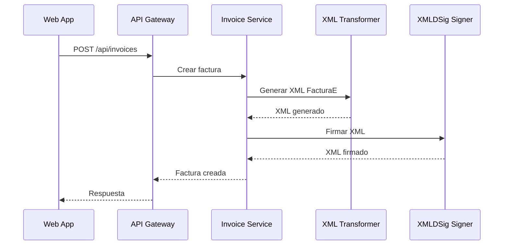

# 💼 Sistema de Facturación para Autónomos

Plataforma completa de gestión de facturación diseñada específicamente para profesionales autónomos en España, con integración directa con la AEAT.

## 🎯 Casos de Uso

### Para Autónomos Individuales

- Gestión completa de facturas y clientes
- Integración automática con AEAT
- Control de pagos y recordatorios
- Informes fiscales trimestrales

### Para Gestorías

- Gestión multi-cliente centralizada
- Automatización de cálculos fiscales
- Portal colaborativo con clientes
- Reporting detallado

### Para Pequeñas Empresas

- Facturación recurrente
- Sistema multi-usuario con roles
- API para integraciones
- Gestión internacional

## ✨ Características

- Cumplimiento normativa española
- Cálculo automático IRPF e IVA
- Modelos 130, 303, 390
- Exportación PDF/Excel
- Webhooks y notificaciones

## 🔄 Idempotencia

Los siguientes endpoints soportan el header `Idempotency-Key` para prevenir operaciones duplicadas:

- `POST /api/auth/register` - Registro de usuarios
- `POST /api/auth/reset-password` - Reset de contraseña
- `POST /api/invoices` - Creación de facturas
- `PUT /api/invoices/:id` - Actualización de facturas
- `POST /api/invoices/:id/send` - Envío de facturas
- `POST /api/subscriptions` - Creación de suscripciones

### Uso del Idempotency-Key

```bash
curl -X POST https://api.example.com/api/invoices \
  -H "Idempotency-Key: unique-key-123" \
  -H "Content-Type: application/json" \
  -d '{...}'
```

- La clave debe ser única por operación
- Se recomienda usar UUID v4
- Las claves expiran después de 24 horas
- Si se reintenta con la misma clave, se retorna la respuesta original

### Webhooks

Los webhooks de Stripe y AEAT son automáticamente deduplicados usando el ID único del evento. No es necesario enviar `Idempotency-Key`.

## 🏗️ Arquitectura

Stack: Next.js 15, React 19, Node.js, PostgreSQL, Prisma, Redis
Componentes: Web App, API Gateway, Auth Service, Invoice Service, Tax Calculator

### 📁 Estructura del Monorepo

```
facturacion-autonomos-monorepo/
├── apps/
│   ├── web/                    # Frontend Next.js (puerto 3000)
│   ├── api-gateway/           # API Gateway (puerto 3001)
│   ├── auth-service/          # Servicio de autenticación (puerto 3003)
│   ├── invoice-service/       # Servicio de facturas (puerto 3002)
│   └── api-tax-calculator/    # Calculadora de impuestos (puerto 3004)
├── packages/
│   ├── database/              # Configuración Prisma y tipos compartidos
│   ├── ui/                    # Componentes UI compartidos
│   └── validation/            # Esquemas de validación
└── tools/                     # Scripts y herramientas de desarrollo
```

### 🔌 Puertos de Servicios

- **Web Frontend**: `http://localhost:3000`
- **API Gateway**: `http://localhost:3001`
- **Invoice Service**: `http://localhost:3002`
- **Auth Service**: `http://localhost:3003`
- **Tax Calculator**: `http://localhost:3004`
- **PostgreSQL**: `localhost:5432`
- **Redis**: `localhost:6379`

### 📂 Organización del Código

Todo el código de la aplicación web debe estar ubicado en `apps/web/src/`. Se utiliza el alias `@/*` para importar desde la carpeta `src/`. No deben existir directorios `lib/` o `components/` en la raíz de `apps/web/`.

## � Inicio Rápido

### 1. Configuración de Variables de Entorno

Copia el archivo de ejemplo y configura las variables necesarias:

```bash
cp .env.example .env
# Edita .env con tus valores específicos
```

**Variables críticas que debes configurar:**

- `DATABASE_URL`: URL de conexión a PostgreSQL
- `JWT_ACCESS_SECRET`: Clave secreta para tokens JWT (mínimo 32 caracteres)
- `JWT_REFRESH_SECRET`: Clave secreta para refresh tokens (mínimo 32 caracteres)
- `SESSION_SECRET`: Clave secreta para sesiones (mínimo 32 caracteres)

⚠️ **Importante**: Nunca commitees archivos `.env` reales. Solo `.env.example` debe estar en el repositorio.

### 2. Instalación con Docker (Recomendado)

```bash
# Construir e iniciar todos los servicios
docker-compose up --build

# O en segundo plano
docker-compose up -d --build
```

### 3. Instalación Manual

```bash
# Instalar dependencias
pnpm install

# Iniciar base de datos y Redis
docker-compose up db redis -d

# Ejecutar migraciones de Prisma
cd packages/database && pnpm prisma migrate dev

# Iniciar servicios en terminales separadas
pnpm run dev  # Inicia todos los servicios con Turbo
```

## �📦 Requisitos

- Node.js 20+
- PostgreSQL 14+
- 4GB RAM, 20GB SSD

## 🏗️ Arquitectura de Servicios

### Servicios del Monorepo

| Servicio | Puerto | Descripción | Endpoints Principales |
|----------|--------|-------------|----------------------|
| **API Gateway** | 3001 | Punto de entrada unificado | `/api/*` |
| **Invoice Service** | 3002 | Gestión de facturas | `/invoices`, `/invoices/:id/xml` |
| **Auth Service** | 3003 | Autenticación y autorización | `/auth/login`, `/auth/register` |
| **XML Transformer** | 3004 | Transformación XML FacturaE | `/transform`, `/health` |
| **Web App** | 5173 | Aplicación frontend (Vite) | Interfaz de usuario |
| **Subscription Service** | 3006 | Gestión de suscripciones | `/subscriptions` |

### Flujo de Generación y Firma XML



## ⚠️ Servicios de Desarrollo

### TimestampService

El `timestamp-service.ts` es **SOLO para desarrollo**. En producción:

- El servicio lanza error al intentar instanciarse
- Los métodos fallan si `NODE_ENV=production`
- Para producción, integrar con TSA real (Autoridad de Sellado de Tiempo)

```typescript
// ❌ En producción falla
const service = new TimestampService(); // Error!

// ✅ Solo funciona en desarrollo
process.env.NODE_ENV = 'development';
const service = createTimestampService(); // OK
```

### Configuración de Certificados Digitales

Para firmar XML FacturaE, configura las siguientes variables:

```bash
# Certificado P12/PFX (recomendado)
CERTIFICATE_PATH=/path/to/certificate.p12
CERTIFICATE_PASSWORD=your-certificate-password

# Alternativamente, certificados PEM
CERTIFICATE_PEM_PATH=/path/to/certificate.pem
PRIVATE_KEY_PEM_PATH=/path/to/private-key.pem
```

## 💼 Licencia

Software de código cerrado. Contacto para licenciamiento comercial.
