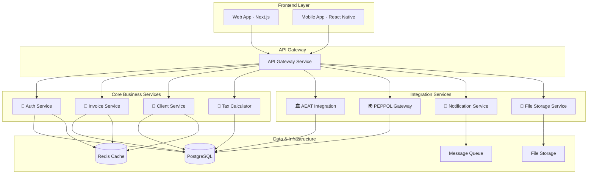

# 🏗️ ARQUITECTURA DE MICROSERVICIOS - SISTEMA COMPLETO

> **Diseño escalable y funcional para plataforma de facturación autónomos**

---

## 🎯 VISIÓN GENERAL

### **MICROSERVICIOS CORE (8 servicios especializados)**



---

## 📦 MICROSERVICIOS DETALLADOS

### **🔐 1. AUTH SERVICE (Puerto 4001)**

**Responsabilidad**: Autenticación, autorización y gestión de usuarios

```typescript
// apps/api-auth/src/structure
├── controllers/
│   ├── auth.controller.ts        # Login/logout/register
│   ├── user.controller.ts        # Gestión usuarios
│   ├── role.controller.ts        # Gestión roles
│   └── session.controller.ts     # Gestión sesiones
├── services/
│   ├── auth.service.ts           # Lógica autenticación
│   ├── jwt.service.ts            # Gestión JWT tokens
│   ├── password.service.ts       # Hash/verificación passwords
│   ├── 2fa.service.ts            # Two-factor authentication
│   └── oauth.service.ts          # OAuth providers (Google, etc)
├── middleware/
│   ├── auth.middleware.ts        # Verificación tokens
│   ├── rate-limit.middleware.ts  # Rate limiting
│   └── rbac.middleware.ts        # Role-based access control
├── schemas/
│   ├── user.schema.ts            # Validación usuarios
│   ├── auth.schema.ts            # Validación auth requests
│   └── role.schema.ts            # Validación roles
└── utils/
    ├── token.util.ts             # Utilidades JWT
    ├── crypto.util.ts            # Utilidades crypto
    └── validation.util.ts        # Validaciones custom
```

**Features**:
- ✅ JWT + Refresh Tokens con rotación automática
- ✅ 2FA con TOTP (Google Authenticator)
- ✅ OAuth2 (Google, Microsoft, LinkedIn)
- ✅ Rate limiting por IP y usuario
- ✅ RBAC (Role-Based Access Control)
- ✅ Session management distribuido
- ✅ Password policies avanzadas
- ✅ Audit logging completo

### **📄 2. INVOICE SERVICE (Puerto 4002)**

**Responsabilidad**: Gestión completa de facturas y documentos fiscales

```typescript
// apps/api-invoice/src/structure
├── controllers/
│   ├── invoice.controller.ts     # CRUD facturas
│   ├── template.controller.ts    # Plantillas factura
│   ├── series.controller.ts      # Series numeración
│   └── draft.controller.ts       # Borradores facturas
├── services/
│   ├── invoice.service.ts        # Lógica negocio facturas
│   ├── numbering.service.ts      # Auto-numeración inteligente
│   ├── validation.service.ts     # Validaciones fiscales
│   ├── calculation.service.ts    # Cálculos automáticos
│   ├── pdf.service.ts            # Generación PDF
│   └── email.service.ts          # Envío automático
├── generators/
│   ├── pdf.generator.ts          # Motor PDF avanzado
│   ├── xml.generator.ts          # FacturaE/UBL XML
│   └── template.generator.ts     # Plantillas personalizables
├── validators/
│   ├── fiscal.validator.ts       # Validaciones fiscales
│   ├── aeat.validator.ts         # Validaciones AEAT
│   └── business.validator.ts     # Reglas negocio
└── integrations/
    ├── tax-service.integration.ts
    ├── aeat-service.integration.ts
    └── file-service.integration.ts
```

**Features**:
- ✅ Auto-numeración inteligente por series
- ✅ Plantillas customizables con editor visual
- ✅ Cálculos automáticos (IVA, IRPF, Recargo)
- ✅ Generación PDF con watermarks
- ✅ Exportación FacturaE/UBL XML
- ✅ Envío automático por email
- ✅ Estados workflow (borrador→enviada→pagada)
- ✅ Vencimientos y recordatorios
- ✅ Multi-divisa con conversión automática

### **👥 3. CLIENT SERVICE (Puerto 4003)**

**Responsabilidad**: CRM completo para gestión de clientes y proveedores

```typescript
// apps/api-client/src/structure
├── controllers/
│   ├── client.controller.ts      # CRUD clientes
│   ├── contact.controller.ts     # Contactos adicionales
│   ├── address.controller.ts     # Direcciones múltiples
│   └── category.controller.ts    # Categorización clientes
├── services/
│   ├── client.service.ts         # Lógica negocio
│   ├── validation.service.ts     # Validación NIF/CIF/VAT
│   ├── enrichment.service.ts     # Enriquecimiento datos
│   ├── analytics.service.ts      # Analytics clientes
│   └── import.service.ts         # Importación masiva
├── validators/
│   ├── nif.validator.ts          # Validación NIFs españoles
│   ├── vat.validator.ts          # Validación VAT europeos
│   └── business.validator.ts     # Validaciones negocio
├── integrations/
│   ├── vat-validation.api.ts     # API validación VAT UE
│   ├── company-data.api.ts       # APIs datos empresariales
│   └── credit-check.api.ts       # Checks solvencia
└── analytics/
    ├── client-insights.ts        # Insights clientes
    ├── payment-behavior.ts       # Comportamiento pago
    └── profitability.ts          # Análisis rentabilidad
```

**Features**:
- ✅ Validación automática NIF/CIF/VAT
- ✅ Enriquecimiento automático datos empresa
- ✅ Direcciones múltiples y contactos
- ✅ Categorización y segmentación
- ✅ Histórico completo facturación
- ✅ Analytics comportamiento pago
- ✅ Importación masiva Excel/CSV
- ✅ Integración APIs externos (AXESOR, etc)

### **🧮 4. TAX CALCULATOR SERVICE (Puerto 4004)**

**Responsabilidad**: Motor fiscal y cálculos tributarios avanzados

```typescript
// apps/api-tax/src/structure
├── controllers/
│   ├── calculation.controller.ts  # Cálculos en tiempo real
│   ├── quarterly.controller.ts    # Cierres trimestrales
│   ├── annual.controller.ts       # Cierres anuales
│   └── estimation.controller.ts   # Estimaciones fiscales
├── services/
│   ├── tax-engine.service.ts      # Motor cálculo principal
│   ├── iva.service.ts             # Cálculos IVA
│   ├── irpf.service.ts            # Cálculos IRPF
│   ├── quarterly.service.ts       # Cierres trimestrales
│   ├── annual.service.ts          # Cierres anuales
│   └── prediction.service.ts      # Predicciones ML
├── engines/
│   ├── iva-engine.ts              # Motor IVA avanzado
│   ├── irpf-engine.ts             # Motor IRPF
│   ├── estimacion-engine.ts       # Módulos/estimación
│   └── deduction-engine.ts        # Motor deducciones
├── ml/
│   ├── tax-prediction.model.ts    # Modelo ML predicciones
│   ├── anomaly-detection.ts       # Detección anomalías
│   └── optimization.ts            # Optimización fiscal
└── integrations/
    ├── aeat-rates.api.ts          # Tipos AEAT actualizados
    ├── boe-scraper.ts             # Scraper BOE cambios
    └── hacienda-api.ts            # APIs oficiales
```

**Features**:
- ✅ Cálculos IVA multi-tipo en tiempo real
- ✅ IRPF con deducciones automáticas
- ✅ Cierres trimestrales automatizados
- ✅ Predicciones ML pagos futuros
- ✅ Optimización fiscal automática
- ✅ Detección anomalías fiscales
- ✅ Actualización automática tipos BOE
- ✅ Simulaciones escenarios fiscales

### **🏛️ 5. AEAT INTEGRATION SERVICE (Puerto 4005)**

**Responsabilidad**: Integración completa con sistemas AEAT/Hacienda

```typescript
// apps/api-aeat/src/structure
├── controllers/
│   ├── sii.controller.ts          # SII - Suministro Inmediato
│   ├── aeat-models.controller.ts  # Modelos AEAT (303, 130, etc)
│   ├── tbai.controller.ts         # TicketBAI País Vasco
│   └── verifactu.controller.ts    # VeriFactu (futuro)
├── services/
│   ├── sii.service.ts             # Lógica SII completa
│   ├── xml-generation.service.ts  # Generación XMLs AEAT
│   ├── digital-signature.service.ts # Firma digital
│   ├── submission.service.ts      # Envío automático
│   └── status-tracking.service.ts # Seguimiento estados
├── generators/
│   ├── sii-xml.generator.ts       # XMLs SII
│   ├── model-303.generator.ts     # Modelo 303 IVA
│   ├── model-130.generator.ts     # Modelo 130 IRPF
│   └── tbai-xml.generator.ts      # XMLs TicketBAI
├── crypto/
│   ├── certificate.manager.ts     # Gestión certificados
│   ├── signer.service.ts          # Firma XMLDSig
│   └── validator.service.ts       # Validación firmas
└── integrations/
    ├── sii-api.client.ts          # Cliente API SII
    ├── tbai-api.client.ts         # Cliente TicketBAI
    └── aeat-oauth.client.ts       # OAuth AEAT
```

**Features**:
- ✅ SII - Suministro Inmediato Información
- ✅ Generación automática Modelos 303/130
- ✅ TicketBAI País Vasco completo
- ✅ Firma digital XMLDSig automática
- ✅ Gestión certificados digitales
- ✅ Retry automático con exponential backoff
- ✅ Reconciliación estados AEAT
- ✅ Alertas incidencias automáticas

### **🌍 6. PEPPOL GATEWAY SERVICE (Puerto 4006)**

**Responsabilidad**: Gateway PEPPOL para facturación electrónica B2B

```typescript
// apps/api-peppol/src/structure
├── controllers/
│   ├── document.controller.ts     # Envío/recepción docs
│   ├── participant.controller.ts  # Gestión participantes
│   ├── capability.controller.ts   # Capacidades documento
│   └── monitoring.controller.ts   # Monitoreo transmisiones
├── services/
│   ├── gateway.service.ts         # Gateway principal
│   ├── transformation.service.ts  # Transformación UBL
│   ├── validation.service.ts      # Validación CIUS-ES
│   ├── as4.service.ts             # Protocolo AS4
│   └── smp.service.ts             # Service Metadata Publisher
├── transformers/
│   ├── ubl-invoice.transformer.ts # FacturaE → UBL Invoice
│   ├── ubl-credit.transformer.ts  # FacturaE → UBL Credit Note
│   └── facturae-parser.ts         # Parser FacturaE
├── validators/
│   ├── bis3.validator.ts          # Validador BIS 3.0
│   ├── cius-es.validator.ts       # Validador CIUS-ES
│   └── schematron.validator.ts    # Validador Schematron
├── protocols/
│   ├── as4-client.ts              # Cliente AS4/ebMS3
│   ├── receipt-handler.ts         # Manejo receipts
│   └── error-handler.ts           # Manejo errores AS4
└── directory/
    ├── smp-lookup.ts              # Lookup SMP
    ├── participant-lookup.ts      # Lookup participantes
    └── capability-lookup.ts       # Lookup capacidades
```

**Features**:
- ✅ Transformación automática FacturaE ↔ UBL
- ✅ Validación CIUS-ES y BIS 3.0
- ✅ Protocolo AS4/ebMS3 completo
- ✅ SMP Lookup automático
- ✅ Directory PEPPOL integration
- ✅ Receipt handling automático
- ✅ Error recovery inteligente
- ✅ Monitoring transmisiones tiempo real

### **📧 7. NOTIFICATION SERVICE (Puerto 4007)**

**Responsabilidad**: Centro de notificaciones multi-canal

```typescript
// apps/api-notification/src/structure
├── controllers/
│   ├── email.controller.ts        # Envío emails
│   ├── sms.controller.ts          # Envío SMS
│   ├── push.controller.ts         # Push notifications
│   └── webhook.controller.ts      # Webhooks externos
├── services/
│   ├── notification.service.ts    # Orquestador principal
│   ├── email.service.ts           # Servicio email
│   ├── sms.service.ts             # Servicio SMS
│   ├── push.service.ts            # Servicio push
│   ├── template.service.ts        # Motor plantillas
│   └── queue.service.ts           # Gestión colas
├── providers/
│   ├── sendgrid.provider.ts       # SendGrid email
│   ├── ses.provider.ts            # Amazon SES
│   ├── twilio.provider.ts         # Twilio SMS
│   ├── firebase.provider.ts       # Firebase push
│   └── expo.provider.ts           # Expo push
├── templates/
│   ├── email/                     # Plantillas email
│   ├── sms/                       # Plantillas SMS
│   └── push/                      # Plantillas push
├── processors/
│   ├── bulk.processor.ts          # Envío masivo
│   ├── scheduled.processor.ts     # Envío programado
│   └── retry.processor.ts         # Reintentos
└── analytics/
    ├── delivery.analytics.ts      # Analytics entrega
    ├── engagement.analytics.ts    # Analytics engagement
    └── performance.analytics.ts   # Analytics rendimiento
```

**Features**:
- ✅ Multi-canal (Email, SMS, Push, Webhook)
- ✅ Plantillas visuales con editor
- ✅ Envío masivo con throttling
- ✅ Programación envíos futuros
- ✅ Retry automático con exponential backoff
- ✅ A/B testing automático
- ✅ Analytics completos entrega
- ✅ Compliance GDPR automático

### **📁 8. FILE STORAGE SERVICE (Puerto 4008)**

**Responsabilidad**: Gestión avanzada de archivos y documentos

```typescript
// apps/api-storage/src/structure
├── controllers/
│   ├── upload.controller.ts       # Subida archivos
│   ├── download.controller.ts     # Descarga archivos
│   ├── document.controller.ts     # Gestión documentos
│   └── backup.controller.ts       # Backup/restore
├── services/
│   ├── storage.service.ts         # Orquestador storage
│   ├── upload.service.ts          # Lógica subida
│   ├── processing.service.ts      # Procesamiento archivos
│   ├── compression.service.ts     # Compresión inteligente
│   ├── preview.service.ts         # Generación previews
│   └── virus-scan.service.ts      # Antivirus scanning
├── providers/
│   ├── s3.provider.ts             # Amazon S3
│   ├── gcs.provider.ts            # Google Cloud Storage
│   ├── azure.provider.ts          # Azure Blob Storage
│   └── local.provider.ts          # Storage local
├── processors/
│   ├── image.processor.ts         # Procesamiento imágenes
│   ├── pdf.processor.ts           # Procesamiento PDFs
│   ├── document.processor.ts      # Procesamiento docs
│   └── video.processor.ts         # Procesamiento videos
├── security/
│   ├── encryption.service.ts      # Encriptación at-rest
│   ├── access-control.ts          # Control acceso
│   └── watermark.service.ts       # Watermarks automáticos
└── analytics/
    ├── usage.analytics.ts         # Analytics uso
    ├── performance.analytics.ts   # Analytics rendimiento
    └── cost.analytics.ts          # Analytics costos
```

**Features**:
- ✅ Multi-provider (S3, GCS, Azure, Local)
- ✅ Compresión inteligente automática
- ✅ Generación thumbnails/previews
- ✅ Antivirus scanning automático
- ✅ Encriptación at-rest y in-transit
- ✅ Watermarks automáticos
- ✅ CDN integration automático
- ✅ Backup automático multi-región

---

## 🌐 API GATEWAY & ROUTING

### **Gateway Centralizado (Puerto 4000)**

```typescript
// apps/api-gateway/src/structure
├── routes/
│   ├── auth.routes.ts             # Proxy a auth service
│   ├── invoice.routes.ts          # Proxy a invoice service
│   ├── client.routes.ts           # Proxy a client service
│   ├── tax.routes.ts              # Proxy a tax service
│   ├── aeat.routes.ts             # Proxy a aeat service
│   ├── peppol.routes.ts           # Proxy a peppol service
│   ├── notification.routes.ts     # Proxy a notification service
│   └── storage.routes.ts          # Proxy a storage service
├── middleware/
│   ├── auth.middleware.ts         # Verificación JWT
│   ├── rate-limit.middleware.ts   # Rate limiting global
│   ├── cors.middleware.ts         # CORS policies
│   ├── logging.middleware.ts      # Logging requests
│   └── circuit-breaker.ts         # Circuit breaker
├── services/
│   ├── proxy.service.ts           # Proxy inteligente
│   ├── load-balancer.service.ts   # Load balancing
│   ├── health-check.service.ts    # Health checks
│   └── discovery.service.ts       # Service discovery
├── security/
│   ├── jwt.validator.ts           # Validación JWT
│   ├── api-key.validator.ts       # Validación API keys
│   └── rbac.enforcer.ts           # Enforcement RBAC
└── monitoring/
    ├── metrics.collector.ts       # Métricas APM
    ├── tracing.service.ts          # Distributed tracing
    └── alerting.service.ts         # Alertas automáticas
```

### **Rutas Centralizadas**

```typescript
// Estructura de rutas del Gateway
/api/v1/auth/*           → auth-service:4001
/api/v1/invoices/*       → invoice-service:4002
/api/v1/clients/*        → client-service:4003
/api/v1/tax/*            → tax-service:4004
/api/v1/aeat/*           → aeat-service:4005
/api/v1/peppol/*         → peppol-service:4006
/api/v1/notifications/*  → notification-service:4007
/api/v1/storage/*        → storage-service:4008

// Health checks
/health                  → Gateway health
/health/services         → All services health

// Metrics & monitoring
/metrics                 → Prometheus metrics
/docs                    → OpenAPI documentation
```

---

## 📊 COMUNICACIÓN ENTRE SERVICIOS

### **Patrones de Comunicación**

```typescript
// 1. SYNCHRONOUS (HTTP/REST)
interface ServiceCommunication {
  // Consultas inmediatas
  invoice-service → client-service    # Datos cliente
  invoice-service → tax-service       # Cálculos fiscales
  aeat-service → invoice-service      # Datos factura
  peppol-service → client-service     # Validación participante
}

// 2. ASYNCHRONOUS (Message Queue)
interface AsyncCommunication {
  // Eventos de negocio
  'invoice.created'     → [tax-service, aeat-service, notification-service]
  'payment.received'    → [invoice-service, client-service, notification-service]
  'aeat.submitted'      → [invoice-service, notification-service]
  'client.updated'      → [invoice-service, tax-service]
}

// 3. EVENT STREAMING (Apache Kafka/Redis Streams)
interface EventStreaming {
  // Eventos tiempo real
  'user.activity'       → Analytics pipeline
  'api.requests'        → Monitoring pipeline
  'file.uploaded'       → Processing pipeline
  'notification.sent'   → Delivery tracking
}
```

### **Message Queue Architecture**

```yaml
# docker-compose.yml - Message Queue
services:
  redis-streams:
    image: redis:7-alpine
    ports: ["6379:6379"]
    command: redis-server --appendonly yes
    
  rabbitmq:
    image: rabbitmq:3-management
    ports: ["5672:5672", "15672:15672"]
    environment:
      RABBITMQ_DEFAULT_USER: admin
      RABBITMQ_DEFAULT_PASS: ${RABBITMQ_PASSWORD}
    
  kafka:
    image: confluentinc/cp-kafka:latest
    ports: ["9092:9092"]
    environment:
      KAFKA_ZOOKEEPER_CONNECT: zookeeper:2181
      KAFKA_ADVERTISED_LISTENERS: PLAINTEXT://localhost:9092
```

---

## 🗄️ PERSISTENCIA Y DATOS

### **Base de Datos por Servicio**

```sql
-- Database: auth_service
CREATE DATABASE auth_service;
-- Tables: users, roles, permissions, sessions, audit_logs

-- Database: invoice_service  
CREATE DATABASE invoice_service;
-- Tables: invoices, invoice_lines, templates, series, drafts

-- Database: client_service
CREATE DATABASE client_service;
-- Tables: clients, contacts, addresses, categories, relationships

-- Database: tax_service
CREATE DATABASE tax_service;
-- Tables: calculations, quarterly_closures, annual_closures, predictions

-- Database: aeat_service
CREATE DATABASE aeat_service;
-- Tables: submissions, responses, certificates, models, status_tracking

-- Database: peppol_service
CREATE DATABASE peppol_service;
-- Tables: documents, participants, capabilities, transmissions, receipts

-- Database: notification_service
CREATE DATABASE notification_service;
-- Tables: notifications, templates, delivery_logs, analytics

-- Database: storage_service
CREATE DATABASE storage_service;
-- Tables: files, documents, metadata, access_logs, backups
```

### **Shared Data Layer**

```typescript
// packages/database/src/clients/
├── auth.client.ts           # Cliente auth_service DB
├── invoice.client.ts        # Cliente invoice_service DB  
├── client.client.ts         # Cliente client_service DB
├── tax.client.ts            # Cliente tax_service DB
├── aeat.client.ts           # Cliente aeat_service DB
├── peppol.client.ts         # Cliente peppol_service DB
├── notification.client.ts   # Cliente notification_service DB
├── storage.client.ts        # Cliente storage_service DB
└── shared.client.ts         # Datos compartidos (config, etc)
```

---

## 🚀 DEPLOYMENT Y ESCALABILIDAD

### **Docker Compose Production**

```yaml
# docker-compose.prod.yml
version: '3.8'
services:
  # API Gateway
  api-gateway:
    build: ./apps/api-gateway
    ports: ["4000:4000"]
    environment:
      - NODE_ENV=production
      - JWT_SECRET=${JWT_SECRET}
    deploy:
      replicas: 3
      resources:
        limits: { memory: 512M, cpus: '0.5' }
    
  # Core Services
  auth-service:
    build: ./apps/api-auth
    ports: ["4001:4001"]
    deploy:
      replicas: 2
      resources:
        limits: { memory: 256M, cpus: '0.3' }
        
  invoice-service:
    build: ./apps/api-invoice
    ports: ["4002:4002"]
    deploy:
      replicas: 3
      resources:
        limits: { memory: 512M, cpus: '0.5' }
        
  client-service:
    build: ./apps/api-client
    ports: ["4003:4003"]
    deploy:
      replicas: 2
      resources:
        limits: { memory: 256M, cpus: '0.3' }
        
  tax-service:
    build: ./apps/api-tax
    ports: ["4004:4004"]
    deploy:
      replicas: 2
      resources:
        limits: { memory: 512M, cpus: '0.5' }
        
  # Integration Services  
  aeat-service:
    build: ./apps/api-aeat
    ports: ["4005:4005"]
    deploy:
      replicas: 2
      resources:
        limits: { memory: 256M, cpus: '0.3' }
        
  peppol-service:
    build: ./apps/api-peppol
    ports: ["4006:4006"]
    deploy:
      replicas: 1
      resources:
        limits: { memory: 512M, cpus: '0.5' }
        
  notification-service:
    build: ./apps/api-notification
    ports: ["4007:4007"]
    deploy:
      replicas: 2
      resources:
        limits: { memory: 256M, cpus: '0.3' }
        
  storage-service:
    build: ./apps/api-storage
    ports: ["4008:4008"]
    deploy:
      replicas: 2
      resources:
        limits: { memory: 512M, cpus: '0.5' }
        
  # Databases
  postgres-cluster:
    image: postgres:15
    deploy:
      replicas: 3
      resources:
        limits: { memory: 2G, cpus: '1.0' }
        
  redis-cluster:
    image: redis:7-cluster
    deploy:
      replicas: 6
      resources:
        limits: { memory: 512M, cpus: '0.5' }
        
  # Message Queue
  rabbitmq-cluster:
    image: rabbitmq:3-management
    deploy:
      replicas: 3
      resources:
        limits: { memory: 1G, cpus: '0.5' }
```

### **Kubernetes Manifests**

```yaml
# k8s/namespace.yaml
apiVersion: v1
kind: Namespace
metadata:
  name: facturacion-system
  
---
# k8s/gateway-deployment.yaml
apiVersion: apps/v1
kind: Deployment
metadata:
  name: api-gateway
  namespace: facturacion-system
spec:
  replicas: 3
  selector:
    matchLabels:
      app: api-gateway
  template:
    metadata:
      labels:
        app: api-gateway
    spec:
      containers:
      - name: api-gateway
        image: facturacion/api-gateway:latest
        ports:
        - containerPort: 4000
        env:
        - name: NODE_ENV
          value: "production"
        - name: JWT_SECRET
          valueFrom:
            secretKeyRef:
              name: auth-secret
              key: jwt-secret
        resources:
          limits:
            memory: "512Mi"
            cpu: "500m"
          requests:
            memory: "256Mi"
            cpu: "250m"
            
---
# k8s/gateway-service.yaml
apiVersion: v1
kind: Service
metadata:
  name: api-gateway-service
  namespace: facturacion-system
spec:
  selector:
    app: api-gateway
  ports:
  - protocol: TCP
    port: 80
    targetPort: 4000
  type: LoadBalancer
```

---

## 📈 MONITOREO Y OBSERVABILIDAD

### **Stack de Monitoreo**

```yaml
# Prometheus + Grafana + Jaeger
services:
  prometheus:
    image: prom/prometheus:latest
    ports: ["9090:9090"]
    volumes:
      - ./monitoring/prometheus.yml:/etc/prometheus/prometheus.yml
      
  grafana:
    image: grafana/grafana:latest
    ports: ["3000:3000"]
    environment:
      - GF_SECURITY_ADMIN_PASSWORD=${GRAFANA_PASSWORD}
    volumes:
      - ./monitoring/grafana/dashboards:/var/lib/grafana/dashboards
      
  jaeger:
    image: jaegertracing/all-in-one:latest
    ports: ["16686:16686", "14268:14268"]
    environment:
      - COLLECTOR_ZIPKIN_HTTP_PORT=9411
      
  elasticsearch:
    image: docker.elastic.co/elasticsearch/elasticsearch:8.11.0
    ports: ["9200:9200"]
    environment:
      - discovery.type=single-node
      - xpack.security.enabled=false
      
  kibana:
    image: docker.elastic.co/kibana/kibana:8.11.0
    ports: ["5601:5601"]
    environment:
      - ELASTICSEARCH_HOSTS=http://elasticsearch:9200
```

### **Métricas por Servicio**

```typescript
// Métricas estándar para todos los servicios
interface ServiceMetrics {
  // Request metrics
  http_requests_total: Counter
  http_request_duration_seconds: Histogram
  http_requests_in_flight: Gauge
  
  // Business metrics
  invoices_created_total: Counter
  invoices_sent_total: Counter
  aeat_submissions_total: Counter
  peppol_transmissions_total: Counter
  
  // System metrics
  nodejs_heap_size_used_bytes: Gauge
  nodejs_heap_size_total_bytes: Gauge
  nodejs_eventloop_lag_seconds: Histogram
  
  // Custom metrics
  database_connections_active: Gauge
  cache_hit_ratio: Gauge
  queue_messages_pending: Gauge
}
```

---

## 🔧 DESARROLLO Y DEPLOYMENT

### **Scripts de Desarrollo**

```json
// package.json - Scripts actualizados
{
  "scripts": {
    // Desarrollo individual
    "dev:gateway": "yarn workspace @facturacion/api-gateway dev",
    "dev:auth": "yarn workspace @facturacion/api-auth dev", 
    "dev:invoice": "yarn workspace @facturacion/api-invoice dev",
    "dev:client": "yarn workspace @facturacion/api-client dev",
    "dev:tax": "yarn workspace @facturacion/api-tax dev",
    "dev:aeat": "yarn workspace @facturacion/api-aeat dev",
    "dev:peppol": "yarn workspace @facturacion/api-peppol dev",
    "dev:notification": "yarn workspace @facturacion/api-notification dev",
    "dev:storage": "yarn workspace @facturacion/api-storage dev",
    
    // Desarrollo conjunto
    "dev:core": "concurrently \"yarn dev:gateway\" \"yarn dev:auth\" \"yarn dev:invoice\" \"yarn dev:client\"",
    "dev:integration": "concurrently \"yarn dev:aeat\" \"yarn dev:peppol\" \"yarn dev:notification\" \"yarn dev:storage\"",
    "dev:all": "concurrently \"yarn dev:core\" \"yarn dev:integration\"",
    
    // Build y deploy
    "build:services": "turbo build --filter='@facturacion/api-*'",
    "deploy:staging": "docker-compose -f docker-compose.staging.yml up -d",
    "deploy:prod": "docker-compose -f docker-compose.prod.yml up -d",
    
    // Testing
    "test:unit": "turbo test --filter='@facturacion/api-*'",
    "test:integration": "jest --config=jest.integration.config.js",
    "test:e2e": "cypress run --spec='cypress/e2e/**/*.cy.ts'"
  }
}
```

### **Generación Automática Servicios**

```bash
# CLI para generar nuevos microservicios
yarn generate:service --name=payment --port=4009 --database=payment_service

# Genera automáticamente:
# - apps/api-payment/
# - Database schema
# - Docker configuration  
# - Kubernetes manifests
# - Gateway routes
# - Tests template
```

---

## 💰 ESTIMACIÓN DESARROLLO

### **Timeline por Servicio**

| Servicio | Desarrollo | Testing | Total | Desarrolladores |
|----------|------------|---------|-------|----------------|
| **Gateway + Auth** | 2 semanas | 1 semana | 3 semanas | 2 devs |
| **Invoice Service** | 3 semanas | 1 semana | 4 semanas | 2 devs |
| **Client Service** | 2 semanas | 1 semana | 3 semanas | 1 dev |
| **Tax Service** | 3 semanas | 1 semana | 4 semanas | 2 devs |
| **AEAT Service** | 4 semanas | 2 semanas | 6 semanas | 2 devs |
| **PEPPOL Service** | 5 semanas | 2 semanas | 7 semanas | 2 devs |
| **Notification Service** | 2 semanas | 1 semana | 3 semanas | 1 dev |
| **Storage Service** | 3 semanas | 1 semana | 4 semanas | 2 devs |

### **Total Estimación**
- **Desarrollo paralelo**: 12 semanas (3 meses)
- **Equipo necesario**: 6-8 desarrolladores
- **Budget estimado**: €180K - €240K

---

## ✅ PRÓXIMOS PASOS IMPLEMENTACIÓN

### **FASE 1: Fundación (Semanas 1-4)**
1. ✅ **API Gateway** + routing básico
2. ✅ **Auth Service** + JWT completo
3. ✅ **Base Docker/K8s** setup
4. ✅ **CI/CD pipeline** básico

### **FASE 2: Core Business (Semanas 5-8)**  
1. ✅ **Invoice Service** completo
2. ✅ **Client Service** completo
3. ✅ **Tax Service** motor básico
4. ✅ **Notification Service** email/SMS

### **FASE 3: Integrations (Semanas 9-12)**
1. ✅ **AEAT Service** SII básico
2. ✅ **Storage Service** completo
3. ✅ **PEPPOL Service** UBL básico
4. ✅ **Monitoreo completo**

**🚀 ¿Empezamos con la implementación? ¿Te enfocas en algún servicio específico primero?**
